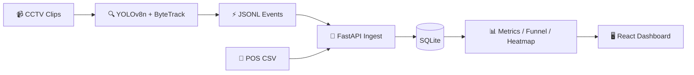

<div align="center">

# 🏪 Store Intelligence

### Raw CCTV → Computer Vision → Live Retail Analytics API

**Purplle Tech Challenge 2026 · Round 2** · Apex Retail offline stores  
**Store ST1008** · Brigade Road, Bangalore · 5 cameras

<br/>

[](docker-compose.yml)
[](backend/main.py)
[](pipeline/run_pipeline.py)
[](dashboard/)
[](tests/)
[](backend/db.py)

<br/>

**[🚀 Live Demo on Hugging Face](https://huggingface.co/spaces/SandeepChakka/store-intelligence)** &nbsp;·&nbsp;
**[📖 API Docs](https://huggingface.co/spaces/SandeepChakka/store-intelligence/docs)** &nbsp;·&nbsp;
**[✅ Evaluation Map](EVALUATION_ALIGNMENT.md)**

<br/>

*End-to-end system: detection, tracking, session funnel, POS correlation, anomalies — built for real-world ambiguity, not lab-perfect accuracy.*

</div>

---

## 👋 For reviewers (10-minute path)

| Step | Time | Action |
|------|------|--------|
| 1 | 2 min | `docker compose up --build` |
| 2 | 1 min | Open **http://localhost:8000/stores/ST1008/metrics** |
| 3 | 1 min | Open **http://localhost:5173** (dashboard) |
| 4 | 2 min | Skim **[DESIGN.md](DESIGN.md)** + **[CHOICES.md](CHOICES.md)** |
| 5 | 2 min | Inspect **`data/events/output.jsonl`** (69 structured events) |
| 6 | 2 min | `pytest tests/ -v` (12 tests) |

**No manual steps.** Pre-committed `output.jsonl` skips the 20+ min YOLO run on review hardware. Optional: mount `CCTV Footage/` to re-run the pipeline (see [RUN_GUIDE.md](RUN_GUIDE.md)).

Full rubric mapping → **[EVALUATION_ALIGNMENT.md](EVALUATION_ALIGNMENT.md)**

---

## ✨ What this system does

Apex Retail has **40 stores** with no offline analytics. This project closes that gap for one real store:

| Stage | You get |
|-------|---------|
| **Detection** | YOLOv8n + ByteTrack on 5 CCTV clips |
| **Intelligence** | ENTRY/EXIT, zones, queue, billing, staff flags |
| **API** | Real-time metrics, session funnel, heatmap, anomalies |
| **Dashboard** | Live React UI + WebSocket metrics stream |

**North-star metric:** *Offline conversion rate* = purchasing sessions ÷ unique visitor sessions (staff excluded).

---

## 🏗 Architecture



| Principle | How we implement it |
|-----------|---------------------|
| **No hardcoded store IDs** | Discovery scripts → `configs/generated/` |
| **Session funnel** | `sessions` table — no double-counting re-entries |
| **Staff handling** | Trajectory + multi-zone heuristics |
| **Production-aware** | Structured logs, health checks, idempotent ingest |
| **CPU-first** | YOLOv8**n**, frame stride 8 — runs on Intel i5 |

---

## 🚦 Acceptance gate (mandatory)

| Check | Status | Proof |
|-------|--------|-------|
| `docker compose up` | ✅ | [docker-compose.yml](docker-compose.yml) |
| `/metrics` JSON | ✅ | `GET /stores/ST1008/metrics` |
| Structured events | ✅ | [data/events/output.jsonl](data/events/output.jsonl) |
| DESIGN.md + CHOICES.md | ✅ | Non-trivial engineering docs |
| Stability | ✅ | Healthcheck + 12 pytest tests |

---

## ⚡ Quick start (Docker — recommended)

```bash
git clone https://github.com/Chakkasandeep/store-intelligence.git
cd store-intelligence
docker compose up --build
```

| Service | URL |
|---------|-----|
| **API** | http://localhost:8000 |
| **Swagger** | http://localhost:8000/docs |
| **Metrics** | http://localhost:8000/stores/ST1008/metrics |
| **Dashboard** | http://localhost:5173 |

```bash
# Smoke test
curl -s http://localhost:8000/health
curl -s http://localhost:8000/stores/ST1008/metrics
curl -s http://localhost:8000/stores/ST1008/funnel
```

---

## 🛠 Local development (Intel i5)

```bash
python -m venv venv
source venv/bin/activate          # Windows: venv\Scripts\activate
pip install -r requirements.txt
pip install -r requirements-dev.txt

python scripts/discover_all.py
python pipeline/run_pipeline.py --frame-stride 8 --max-frames 600

export PYTHONPATH=.
uvicorn backend.main:app --port 8000
```

```bash
# Terminal 2 — dashboard
cd dashboard && npm install && npm run dev
```

**Optional CCTV:** Place challenge videos in `./CCTV Footage/` (CAM 1.mp4 … CAM 5.mp4).  
**Optional POS:** Place Brigade CSV in repo root for discovery re-run.

Detailed steps → **[RUN_GUIDE.md](RUN_GUIDE.md)**

---

## 📡 API reference

| Method | Endpoint | Description |
|--------|----------|-------------|
| `POST` | `/events/ingest` | Idempotent event ingest (`event_id`) |
| `GET` | `/stores/{id}/metrics` | Visitors, conversion, queue depth |
| `GET` | `/stores/{id}/funnel` | Session-based drop-off funnel |
| `GET` | `/stores/{id}/heatmap` | Zone dwell intensity |
| `GET` | `/stores/{id}/anomalies` | Queue spike, stale feed, conversion drop |
| `GET` | `/health` | Component health + feed freshness |
| `WS` | `/ws/metrics` | Live metrics stream (5s interval) |

Store ID **`ST1008`** is discovered from POS data — not hardcoded in pipeline logic.

---

## 📂 Repository layout

```
store-intelligence/
├── backend/              # FastAPI · metrics · funnel · anomalies
├── pipeline/             # YOLOv8n · ByteTrack · Re-ID · event emit
├── dashboard/            # React + Vite + Tailwind + Recharts
├── scripts/              # discover_* · count_events · analyze_videos
├── configs/generated/    # Data-driven JSON (camera, layout, POS)
├── data/events/          # output.jsonl (committed for fast Docker)
├── tests/                # 12 pytest tests
├── docker/               # Dockerfile + entrypoint
├── DESIGN.md             # Architecture & event flow
├── CHOICES.md            # Trade-offs & AI decisions
└── EVALUATION_ALIGNMENT.md
```

---

## 📚 Documentation index

| Document | Purpose |
|----------|---------|
| [DESIGN.md](DESIGN.md) | System architecture, DB schema, AI decisions |
| [CHOICES.md](CHOICES.md) | Model/API trade-offs (accepted vs rejected) |
| [EVALUATION_ALIGNMENT.md](EVALUATION_ALIGNMENT.md) | Maps 100-mark rubric → code |
| [SUBMISSION_CHECKLIST.md](SUBMISSION_CHECKLIST.md) | Pre-submit verification |
| [RUN_GUIDE.md](RUN_GUIDE.md) | Full install + Docker + validation |
| [COMMANDS.md](COMMANDS.md) | Command cheat sheet |
| [docs/CAMERA_ANALYSIS.md](docs/CAMERA_ANALYSIS.md) | Camera role inference |
| [docs/POS_MAPPING.md](docs/POS_MAPPING.md) | POS correlation rules |

---

## 🌐 Live demo (no CCTV in cloud)

**Hugging Face Space:** https://huggingface.co/spaces/SandeepChakka/store-intelligence  

API + dashboard on one URL (port 7860). Pre-ingested events — instant boot.  
Raw `.mp4` files stay local per challenge licence.

---

## 🧪 Tests

```bash
pip install -r requirements-dev.txt
export PYTHONPATH=.
pytest tests/ -v
```

Covers: ingest idempotency, session funnel, staff exclusion, anomalies, pipeline schema.

---

## ⚠️ Known demo behaviors (documented)

| Observation | Why |
|-------------|-----|
| Current visitors = 0 | Historical CCTV timestamps (Apr 2026) |
| Conversion 0% possible | POS clock vs clip window misalignment |
| STALE_FEED | Suppressed for historical clip dates |

Explained in [CHOICES.md](CHOICES.md) — not hidden edge cases.

---

## 🔒 Integrity

- Metrics are **computed from SQLite** after ingest — not hardcoded JSON responses.
- Re-running the pipeline or ingesting new events **changes** API outputs.
- Committed `output.jsonl` is a **reviewer convenience**; full CV source is in `pipeline/`.

---

## 👤 Author

**Sandeep Chakka**  
Purplle Tech Challenge 2026 · Round 2 · Store Intelligence

| Channel | Link |
|---------|------|
| **GitHub (this repo)** | Primary submission — `docker compose up` |
| **Hugging Face** | [Live demo](https://huggingface.co/spaces/SandeepChakka/store-intelligence) |

---

<div align="center">

**If it runs with `docker compose up` and `/stores/ST1008/metrics` returns JSON — you're looking at the complete pipeline.**

⭐ *Built with engineering judgment over model complexity.*

</div>
