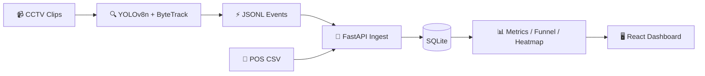

# 🏪 Store Intelligence System

### Raw CCTV → Computer Vision → Live Retail Analytics API

**Purplle Tech Challenge 2026 · Round 2** · Apex Retail offline stores  
**Store ST1008** (Brigade Road, Bangalore) & **Store ST_STORE2** (Second Location)

---

## 👋 Quick Start (Docker — Recommended)

Start the entire system (FastAPI backend + SQLite database + React dashboard) with a single command:

```bash
cd store-intelligence
docker compose up --build
```

### Active URLs:
- **API**: http://localhost:8000
- **API Swagger Docs**: http://localhost:8000/docs
- **React Dashboard**: http://localhost:5173
- **Store 1 Metrics**: http://localhost:8000/stores/ST1008/metrics
- **Store 2 Metrics**: http://localhost:8000/stores/ST_STORE2/metrics

No manual setup required. Store configurations, POS transactions, and sample events are automatically discovered, mapped, and bootstrapped into the database.

---

## ✨ Features

- **Multi-Store Config-Driven Design**: Discovers cameras, layout PNGs, and POS transaction files dynamically, saving metadata under `configs/generated/{store_id}/`.
- **YOLOv8n + ByteTrack CV Pipeline**: Processes footage on CPU, maps bounding boxes to dynamic layout polygons, and tracks visitor movements.
- **Visitor Re-Entry and Session Reopening**: Resumes visitor sessions upon `REENTRY` instead of double-counting visitors in the conversion funnel.
- **Advanced Event Extraction**: Emits `ENTRY`, `EXIT`, `ZONE_ENTER`, `ZONE_EXIT`, `ZONE_DWELL`, `BILLING_QUEUE_JOIN`, `BILLING_QUEUE_ABANDON`, and `REENTRY` events.
- **Legacy Ingestion Adaptor**: Automatically normalizes legacy/sample JSONL shapes (like `sample_eventsbe42122.jsonl` with `id_token` and `event_timestamp`) on ingest.
- **Queue Abandonment Verification**: Automatically prunes `BILLING_QUEUE_ABANDON` events if the customer correlates with a subsequent POS purchase.
- **Real-time Live Metrics Dashboard**: Built in React + TypeScript with standard design tokens, providing store selection dropdowns and real-time WebSocket feeds.

---

## 🏗 System Architecture



---

## ⚡ Local Development & Setup

### 1. Environment Activation
```bash
python -m venv venv
.\venv\Scripts\Activate.ps1   # Linux: source venv/bin/activate
pip install -r requirements.txt
pip install -r requirements-dev.txt
```

### 2. Run Store Discovery
Scans directories and generates store layouts and camera roles:
```bash
python scripts/discover_all.py
```

### 3. Run Pipeline
Processes video feeds and saves tracking outputs:
```bash
# Process Store 1
python pipeline/run_pipeline.py --store-id ST1008 --frame-stride 8 --max-frames 600

# Process Store 2
python pipeline/run_pipeline.py --store-id ST_STORE2 --frame-stride 8 --max-frames 600
```

### 4. Run API & Dashboard
```bash
# Terminal 1: API
$env:PYTHONPATH="."
uvicorn backend.main:app --reload --port 8000

# Terminal 2: React Dashboard
cd dashboard
npm install
npm run dev
```

---

## 🧪 Testing

Execute the full test suite verifying ingest idempotency, legacy schema normalization, session reopening, staff exclusion, and anomalies:

```bash
python -m pytest tests/ -v
```
