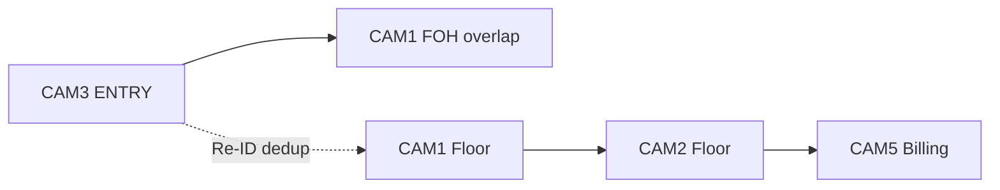

# Camera Refresh Report

**Generated:** 2026-06-03  
**Method:** Motion, brightness asymmetry, edge density heuristics (`scripts/discover_cameras.py` logic) + **mandatory frame review** (filenames not used for final role).  
**Rule:** Filename hints (e.g. `billing_area.mp4`) are noted only as cross-checks after visual audit.

---

## 1. Classification legend

| Role | Definition |
|------|------------|
| `ENTRY_CAMERA` | Fixed view of entrance threshold; inbound/outbound crossing |
| `BILLING_CAMERA` | POS counter + customer queue lane |
| `MAIN_FLOOR_CAMERA` | Aisle / shelf / gondola coverage |
| `OVERLAP_CAMERA` | Partial duplicate FOV of entry or floor (dedup required) |
| `UNKNOWN_CAMERA` | Insufficient signal or conflicting heuristics |

---

## 2. Store 1 — ST1008 (Brigade Road)

### 2.1 Summary table

| Source file | Auto heuristic top | **Final role** | Confidence | Suggested `camera_id` |
|-------------|-------------------|----------------|------------|------------------------|
| `CAM 3 - entry.mp4` | entry (2.76) | **ENTRY_CAMERA** | **0.88** | `ST1008_CAM_ENTRY_01` |
| `CAM 5 - billing.mp4` | billing (2.30) | **BILLING_CAMERA** | **0.92** | `ST1008_CAM_BILLING_01` |
| `CAM 1 - zone.mp4` | billing (2.17)* | **MAIN_FLOOR_CAMERA** | **0.85** | `ST1008_CAM_FLOOR_01` |
| `CAM 2 - zone.mp4` | billing (2.96)* | **MAIN_FLOOR_CAMERA** | **0.85** | `ST1008_CAM_FLOOR_02` |

\*Heuristic favors billing due to shelf edge density; **visual inspection shows product aisles, not POS**.

### 2.2 Per-camera reasoning

#### CAM 3 — ENTRY_CAMERA (0.88)

**Signals:**
- `brightness_asymmetry`: **85.8** (bright interior vs dark exterior right)
- `edge_density`: **13.6** (low — door/glass dominates)
- Center motion: **6.8** (stable mount)

**Reasoning:** Classic threshold camera: glass door, Purplle signage, exterior walkway contrast. Matches challenge “entry/exit threshold” clip.

**Screenshot:** `docs/audit_screenshots/CAM_3_entry_mid.jpg`

**Overlap note:** Shares FOV with CAM 1 FOH; mark as **OVERLAP_CAMERA** pair with `ST1008_CAM_FLOOR_01` for Re-ID dedup.

---

#### CAM 5 — BILLING_CAMERA (0.92)

**Signals:**
- `brightness_asymmetry`: **-12.7** (not entry-like)
- `edge_density`: **29.0**, right-edge **18.8**
- Heuristic ranked **main_floor** — **incorrect without visual override**

**Reasoning:** Frame shows L-shaped white counter, dual laptops, scanners, queue floor space, “ACCESSORIES” display. This is the **authoritative billing feed** for Store 1.

**Screenshot:** `docs/audit_screenshots/CAM_5_billing_mid.jpg`

**Action:** Replace obsolete mapping that assigned `CAM_BILLING_01` → `CAM 2.mp4` in committed `camera_profile.json`.

---

#### CAM 1 — MAIN_FLOOR_CAMERA (0.85)

**Signals:** High edge density (**35.4**), balanced motion across thirds.

**Reasoning:** Wide brand-wall view (Maybelline, Lakmé, Alps Goodness), summer promo island — zone dwell, not entry/billing.

**Screenshot:** `docs/audit_screenshots/CAM_1_zone_mid.jpg`

---

#### CAM 2 — MAIN_FLOOR_CAMERA (0.85)

**Signals:** Highest heuristic billing score in Store 1 set — **misleading**.

**Reasoning:** Cosmetics aisle perpendicular to shelves; no POS hardware in frame. Use for **MAKEUP_SOUTH** / brand-wall zones.

**Screenshot:** `docs/audit_screenshots/CAM_2_zone_mid.jpg`

---

### 2.3 Store 1 overlap map

---

## 3. Store 2 — ID TBD

### 3.1 Summary table

| Source file | Auto heuristic top | **Final role** | Confidence | Suggested `camera_id` |
|-------------|-------------------|----------------|------------|------------------------|
| `entry 1.mp4` | billing (2.33)* | **ENTRY_CAMERA** | **0.90** | `ST2_CAM_ENTRY_01` |
| `entry 2.mp4` | billing (2.75)* | **ENTRY_CAMERA** (overlap) | **0.78** | `ST2_CAM_ENTRY_02` |
| `billing_area.mp4` | billing (2.72)* | **BILLING_CAMERA** | **0.93** | `ST2_CAM_BILLING_01` |
| `zone.mp4` | billing (3.23)* | **MAIN_FLOOR_CAMERA** | **0.91** | `ST2_CAM_FLOOR_01` |

\*960p + different lighting breaks entry asymmetry heuristic; **visual audit overrides**.

### 3.2 Per-camera reasoning

#### entry 1 — ENTRY_CAMERA (0.90)

**Reasoning:** Top-down glass double doors; interior wood floor vs exterior tile; Purplle reverse text; ideal ENTRY/EXIT line at `y≈0.55`.

**Screenshot:** `docs/audit_screenshots/entry_1_mid.jpg` (on-screen label CAM1)

---

#### entry 2 — ENTRY_CAMERA / OVERLAP (0.78)

**Reasoning:** Alternate entrance angle (also labeled CAM1 on OSD). Classify as **second entry feed** — dual-camera entry dedup required (group entry + re-entry).

**Screenshot:** `docs/audit_screenshots/entry_2_mid.jpg`

---

#### billing_area — BILLING_CAMERA (0.93)

**Reasoning:** Clear cash counter, two staff in pink uniforms, customers at queue, POS laptop. Heuristic incorrectly scored as main_floor because 960p reduces asymmetry.

**Screenshot:** `docs/audit_screenshots/billing_area_mid.jpg` (on-screen CAM6)

---

#### zone — MAIN_FLOOR_CAMERA (0.91)

**Reasoning:** Long aisle between skincare shelves (Pilgrim, De-Tan signage), browsing customers — zone_enter/dwell.

**Screenshot:** `docs/audit_screenshots/zone_mid.jpg` (on-screen CAM2)

---

## 4. Comparison: old repo vs new dataset

| Old `camera_profile.json` | New Store 1 |
|---------------------------|-------------|
| 5 files `CAM 1.mp4`…`CAM 5.mp4` in `CCTV Footage/` | 4 files in `Store 1/` |
| `CAM 2` → billing | **`CAM 5 - billing.mp4` → billing** |
| `CAM 3` → entry | **`CAM 3 - entry.mp4` → entry** ✅ |
| `CAM 5` → main_floor | **Wrong — should be billing** |

---

## 5. Implementation changes (pending approval)

1. **`discover_cameras.py`:** Scan `Store */` directories; add visual-audit override table; detect dual-entry stores.
2. **`pipeline/config_loader.py`:** `footage_path(store_id, source_file)`.
3. **Billing disambiguation:** When two clips score high on billing, prefer clip with POS hardware (counter aspect ratio + right-third static edges).
4. **Store 2 resolution:** Separate ROI presets for 960p vs 1080p in `zones.py` or per-camera ROI in layout JSON.

---

## 6. Screenshot index

All under `store-intelligence/docs/audit_screenshots/`:

- `CAM_3_entry_mid.jpg`
- `CAM_5_billing_mid.jpg`
- `CAM_1_zone_mid.jpg`
- `CAM_2_zone_mid.jpg`
- `entry_1_mid.jpg`
- `entry_2_mid.jpg`
- `billing_area_mid.jpg`
- `zone_mid.jpg`

Features JSON: `data/discovery/new_dataset_camera_audit.json`
